# Crear un API REST con Go y MySQL

En esta guía paso a paso para la materia de Tópicos Avanzados de Programación, se creará un servicio web RESTFul que consistirá en un directorio telefónico, con el lenguaje de programación [Go](https://golang.org), el framework HTTP [Echo](https://echo.labstack.com) y el _object-relational mapping tool_ [Gorm](https://gorm.io) para facilitar el manejo de la base de datos MySQL; además de algunas otras librerías que nos facilitarán la creación de nuestro servicio.

## Producto final
Un directorio telefónico que almacena los datos en una base de datos MySQL. El código seguirá buenas prácticas de desarrollo con Go y un modelo muy estándar para aplicaciones web. Permitirá añadir, obtener, modificar y eliminar contactos, mediante un API REST HTTP, utilizando [JSON](https://www.json.org/json-en.html) como lenguaje para intercambio de información. El API incluirá validación de requests y manejo de errores integrado, estará totalmente lista para ser consumida desde una aplicación web o móvil.

## Notas
+ El proyecto funcional terminado lo pueden encontrar en https://github.com/ivan-avalos/directorio-tap para guiarse. :3
+ **Es altamente recomendable que tomen algún curso básico de Go antes de seguir esta guía, ya que manejaremos algunos conceptos que es necesario que conozcan para no confundirse.**
+ En el código, es muy importante que se respeten mayúsculas y minúsculas, ya que las funciones, variables y estructuras que comienzan con minúscula no son accesibles desde otros paquetes. Esto es una característica de Go.
+ En la sesión en la que trabajaremos con esta guía, explicaré un poco más a detalle los pasos.
+ Es posible que en una siguiente sesión, se realice una aplicación móvil que consuma el API REST que creamos en esta sesión, por lo que es muy importante que hagan funcionar bien esto.
+ Un ejemplo de una implementación más completa de una aplicación web con Go, con autenticación de usuarios, paginación y muchas otras funcionalidades, lo pueden encontrar en https://github.com/ivan-avalos/linkbucket-go :3

## Terminología
+ `API`. _Application Development Interface_. Es una interfaz que permite interactuar con un proceso o servicio de una manera sencilla. Hay varios tipos de API. En esta guía se manejará REST.
+ `API REST`. REST significa _REpresentational State Tranfer_. Un API REST incorpora esta arquitectura. En el contexto de esta aplicación, la arquitectura REST permite solicitar transacciones y datos sin proporcionar acceso directo a la BD al cliente, ya que esto es muy peligroso.
+ `JSON`. _JavaScript Object Notation._ Es el lenguaje de intercambio de información y representación de objetos más utilizado actualmente, ya que permite que tanto el servicio como el cliente, hablen el mismo «lenguaje».
+ `Request`. Una petición al servidor con la información necesaria para realizar las operaciones correspondientes. Un ejemplo de request puede ser crear un contacto, para el cuál, se enviarán los datos del contacto a crear en formato JSON.
+ `Response`. Es la respuesta del servidor a un request. Por ejemplo, si el request busca obtener una lista de contactos, el response contendrá esa lista de contactos en formato JSON, así como algunos parámetros adicionales. En caso de error, el response contendrá los detalles del error.

## Estructura
+ `Modelo`. Proporcionan la estructura de la tabla a manejar en forma de un objeto que contiene métodos para su acceso y manipulación. Por ejemplo, un modelo `Contact`.
+ `Controlador`. Recibe los requests HTTP, realiza las operaciones necesarias utilizando los modelos y responde al cliente con los datos solicitados o un error. Por ejemplo: `ContactController`.
+ `Ruta`. Permiten enrutar un request con el controlador correspondiente. Puede contener parámetros Por ejemplo: `/contact/:id` (el parámetro es `id` y un ejemplo de invocación es `/contact/1`).

## Requerimientos
+ Go ([Descargar](https://golang.org/))
+ Git ([Descargar](https://git-scm.com/download/))
+ MySQL ([Descargar](https://dev.mysql.com/downloads/))
+ Postman ([Descargar](https://www.postman.com/downloads/))
+ Visual Studio Code (opcional) ([Descargar](https://code.visualstudio.com)) (de preferencia instalar la extensión `Go` después de instalar Go).

## Inicialización
1. Crear una carpeta llamada `directorio-tap` en `C:\Go\src`.
2. Crear las siguientes carpetas en `C:\Go\src\directorio-tap`:
    + `controllers`
    + `database`
    + `utils`
3. Crear el archivo `main.go` en `C:\Go\src\directorio-tap`.
4. Añadir lo siguiente en `main.go`:
```go
package main

import (
	"fmt"
)

func main() {
    fmt.Println("Hello, World!")
}
```
5. Abrir un CMD y escribir `cd C:\Go\src\directorio-tap` para entrar a la raíz del proyecto.
6. Escribir `go run .` para compilar y ejecutar el programa.
7. Si la salida del programa muestra un `Hello, World!`, ¡todo va bien hasta ahora! :3
8. Crear una BD MySQL llamada `directorio_tap` y un usuario `directorio_tap`, con contraseña `muysegura1234` y con todos los privilegios para la base de datos creada.

## Variables de configuración (godotenv)
1. Para configurar los parámetros de conexión a la base de datos, así como otras configuraciones que pueda requerir nuestro proyecto, crearemos un archivo en la raíz del proyecto llamado `.env`, y escribiremos lo siguiente:
```dotenv
HTTP_PORT=8000
MYSQL_HOST=localhost
MYSQL_DB=directorio_tap
MYSQL_USER=directorio_tap
MYSQL_PASS=muysegura1234
```
3. Para leer nuestro `.env`, necesitaremos el paquete `godotenv`. Para instalarlo, escribimos el comando `go get github.com/joho/godotenv` en el CMD.
4. Modificamos nuestro `main.go` para que quede así:
```go
package main

import (
    "log"

    "github.com/joho/godotenv"
)

func main() {
    // Load config from .env
    if err := godotenv.Load(); err != nil {
        log.Fatal(err) // Imprimir en consola y terminar el programa.
    }
}
```

## Conexión a BD MySQL y modelos Gorm
1. Ejecutamos los siguientes comandos en el CMD para instalar los paquetes necesarios:
	+ `go get github.com/jinzhu/gorm`
	+ `go get github.com/go-sql-driver/mysql` (motor que utiliza Gorm para trabajar con MySQL)
2. En la carpeta `database`, creamos el archivo `contact.go`:
```go
package database

import (
	"github.com/jinzhu/gorm"
)

type (
    // Contact es el modelo del contacto
    Contact struct {
        gorm.Model
        Name  string `gorm:"not null"` // No son comentarios, son parámetros «reflect» y proporcionan metadatos importantes al struct
        Phone string `gorm:"not null"`
    }
    // RequestContact almacena los datos del contacto del request
    RequestContact struct {
        Name  string `json:"name" validate:"required"`
        Phone string `json:"phone" validate:"required"`
    }
    // UpdateContact almacena los datos del contacto del update request
    UpdateContact struct {
        Name  string `json:"name"`
        Phone string `json:"phone"`
    }
    // ResponseContact regresa los datos del contacto para el response
    ResponseContact struct {
        ID    uint   `json:"id"`
        Name  string `json:"name"`
        Phone string `json:"phone"`
    }
)
```
3. En la carpeta `database` y creamos el archivo `base.go`:
```go
package database

import (
    "fmt"
    "log"
    "os"

    // MySQL driver
    _ "github.com/go-sql-driver/mysql"
    "github.com/jinzhu/gorm"
)

var db *gorm.DB

// Init se conecta a la BD y crea la tabla "contacts"
func Init() {
    username := os.Getenv("MYSQL_USER")
    password := os.Getenv("MYSQL_PASS")
    dbName := os.Getenv("MYSQL_DB")
    dbHost := os.Getenv("MYSQL_HOST")
    dbURI := fmt.Sprintf("%s:%s@(%s)/%s?charset=utf8&parseTime=True&loc=Local", username, password, dbHost, dbName) // Formatear un string con parámetros
    log.Printf(dbURI) // Imprimir la URI de conexión para debug

    conn, err := gorm.Open("mysql", dbURI)  // Abrir la conexión con MySQL
    if err != nil {
        log.Fatal(err)
    }
    db = conn
    db.Debug().AutoMigrate(&Contact{}) // Automáticamente generar tabla para el modelo
}

// DB regresa el objeto de base de datos
func DB() *gorm.DB {
    return db
}
```
4. Añadir lo siguiente al `main.go`:
```go
import (
    // ...
    "directorio-tap/database"
)

func main() {
    // ...
    database.Init()
}
```
5. Ubicarnos en la raíz del proyecto en el CMD y ejecutar `go run .`.
6. Si el programa no nos da ningún error, y nuestra BD ahora contiene una tabla llamada `contacts` con los campos `name` y `phone`, ¡todo va bien hasta ahora! :3

## Implementar métodos CRUD para `Contact`
1. Abrimos nuestro archivo `database/contact.go`.
2. Método `Create`:
```go
// Create inserta un contacto en la BD
func (contact *Contact) Create() error {
    return DB().Create(contact).Error
}
```
3. Método `GetContacts`:
```go
// GetContacts regresa todos los contactos en la BD
func GetContacts() ([]*Contact, error) {
    contacts := make([]*Contact, 0)
    err := DB().Find(&contacts).Error
    if err != nil {
        return nil, err
    }
    return contacts, nil
}
```
4. Método `GetContact`:
```go
// GetContact regresa un contacto de la BD
func GetContact(id uint) (*Contact, error) {
    contact := new(Contact)
    err := DB().Where("id = ?", id).First(contact).Error
    if err != nil {
        return nil, err
    }
    return contact, nil
}
```
5. Método `Update`:
```go
// Update guarda los cambios del contacto en la BD
func (contact *Contact) Update() error {
    return DB().Save(contact).Error
}
```
6. Método `Delete`:
```go
// Delete elimina al contacto de la DB
func (contact *Contact) Delete() error {
    return DB().Delete(contact).Error
}
```
7. Añadir lo siguiente al final de `main.go` para probar los métodos anteriores:
```go
// Create
log.Println("Create:")
if err := ivan.Create(); err != nil {
    log.Fatal(err)
}
log.Println(ivan)
// GetContacts
log.Println("GetContacts:")
ivans, err := database.GetContacts()
if err != nil {
    log.Fatal(err)
}
for _, i := range ivans {
    log.Println(i)
}
// GetContact
log.Println("GetContact:")
c, err := database.GetContact(ivan.ID)
if err != nil {
    log.Fatal(err)
}
log.Println(c)
// Update
log.Println("Update:")
ivan.Name = "Návi Losava"
ivan.Phone = "461 321 7654"
if err := ivan.Update(); err != nil {
    log.Fatal(err)
}
navi, err := database.GetContact(ivan.ID)
if err != nil {
    log.Fatal(err)
}
log.Println(navi)
// Delete
log.Println("Delete:")
if err := ivan.Delete(); err != nil {
    log.Fatal(err)
}
ivans, err = database.GetContacts()
if err != nil {
    log.Fatal(err)
}
for _, i := range ivans {
    log.Println(i)
}
```
8. Ejecutar el programa con `go run .`.
9. Si tu salida es algo similar a esto, ¡todo va bien hasta ahora! :3
```
2020/04/22 13:44:32 Create:
2020/04/22 13:44:32 &{{4 2020-04-22 13:44:32.287218 -0500 CDT m=+0.020057142 2020-04-22 13:44:32.287218 -0500 CDT m=+0.020057142 <nil>} Iván Ávalos 461 123 4567}
2020/04/22 13:44:32 GetContacts:
2020/04/22 13:44:32 &{{4 2020-04-22 13:44:32 -0500 CDT 2020-04-22 13:44:32 -0500 CDT <nil>} Iván Ávalos 461 123 4567}
2020/04/22 13:44:32 GetContact:
2020/04/22 13:44:32 &{{4 2020-04-22 13:44:32 -0500 CDT 2020-04-22 13:44:32 -0500 CDT <nil>} Iván Ávalos 461 123 4567}
2020/04/22 13:44:32 Update:
2020/04/22 13:44:32 &{{4 2020-04-22 13:44:32 -0500 CDT 2020-04-22 13:44:32 -0500 CDT <nil>} Návi Losava 461 321 7654}
2020/04/22 13:44:32 Delete:
```
10. Ahora elimina ese código.

## Inicialización del servidor HTTP Echo
1. Ejecutar el comando `go get github.com/labstack/echo` para instalar Echo.
2. Añadir lo siguiente al `main.go` para inicializar el servidor HTTP:
```go
import (
    // ...
    "github.com/labstack/echo"
    "github.com/labstack/echo/middleware"
)

func main() {
    // ...
    e := echo.New()
    e.Use(middleware.Logger()) // marcará error en VS Code, pero no importa. :3

    // Start Echo HTTP server
    e.Logger.Fatal(e.Start(":" + os.Getenv("HTTP_PORT"))) // Iniciar servidor en el puerto definido.
}
```
3. Ejecutar el programa (ya saben cómo :D).
4. Si no da ningún error, ¡todo va bien hasta ahora! :3
5. Ejecutar comando `go get github.com/go-playground/validator` para instalar el paquete `validator` que nos proporcionará la funcionalidad de validación de requests.
6. Añadir lo siguiente al `main.go`, para habilitar la validación en Echo:
```go   
import (
    // ...
    "github.com/go-playground/validator"
)

// CustomValidator is a custom validator
type CustomValidator struct {
    validator *validator.Validate
}

// Validate validates using a CustomValidator
func (cv *CustomValidator) Validate(i interface{}) error {
    return cv.validator.Struct(i)
}

func main() {
    // ...
    e := echo.New()
    e.Use(middleware.Logger())
    e.Validator = &CustomValidator{validator: validator.New()}
    // ...
}
```

## Implementar controlador HTTP y rutas
1. Escribir los siguientes métodos en `database/contact.go`, justo después definiciones de tipo (`type (...)`).
```go
// GetContact returns *Contact from *RequestContact
func (rc *RequestContact) GetContact() *Contact {
    return &Contact{
        Name:  rc.Name,
        Phone: rc.Phone,
    }
}

// GetResponseContact returns *ResponseContact from *Contact
func (contact *Contact) GetResponseContact() *ResponseContact {
    return &ResponseContact {
        ID:    contact.ID,
        Name:  contact.Name,
        Phone: contact.Phone,
    }
}
```
1. Crear un archivo `contact-controller.go` en la carpeta `controllers`.
2. Escribir `package controllers` al inicio del archivo.
3. Escribir la función `CreateContact`:
```go
import (
    // ...
    "directorio-tap/database"
    "github.com/labstack/echo"
)

// CreateContact crea un contacto
func CreateContact(c echo.Context) error {
    requestContact := new(database.RequestContact)
    if err := c.Bind(requestContact); err != nil { // Leer el JSON recibido y llenar el objeto con los datos
        return err
    }
    if err := c.Validate(requestContact); err != nil { // Validar el request según las condiciones definidas
        return err
    }
    contact := requestContact.GetContact()
    if err := contact.Create(); err != nil {
        return err
    }
    return c.JSON(http.StatusOK, contact.GetResponseContact()) // Regresar un response 200 OK con un JSON del contacto
}
```
4. Escribir la función `GetContacts`:
```go
// GetContacts regresa todos los contactos
func GetContacts(c echo.Context) error {
    contacts, err := database.GetContacts()
    if err != nil {
        return err
    }
    responseContacts := make([]*database.ResponseContact, 0)
    for _, c := range contacts { // Obtener los ResponseContact de los Contact obtenidos para el response
        responseContacts = append(responseContacts, c.GetResponseContact())
    }
    return c.JSON(http.StatusOK, responseContacts)
}
```
5. Escribir la función `GetContact`:
```go
import (
    // ...
    "strconv"
)

// GetContact regresa el contacto con un ID
func GetContact(c echo.Context) error {
    id, err := strconv.Atoi(c.Param("id")) // Obtener parámetro :id de la ruta y convertir a int
    if err != nil {
        return err
    }
    contact, err := database.GetContact(uint(id))
    if err != nil {
        return err
    }
    return c.JSON(http.StatusOK, contact.GetResponseContact())
}
```
6. Escribir la función `UpdateContact`:
```go
// UpdateContact modifica el contacto con un ID
func UpdateContact(c echo.Context) error {
    id, err := strconv.Atoi(c.Param("id"))
    if err != nil {
        return err
    }
    updateContact := new(database.UpdateContact)
    if err := c.Bind(updateContact); err != nil {
        return err
    }
    contact, err := database.GetContact(uint(id))
    if err != nil {
        return err
    }
    if updateContact.Name != "" { // Si se proporcionó el campo «name», actualizar el nombre del contacto con lo que tenga
        contact.Name = updateContact.Name
    }
    if updateContact.Phone != "" { // Si se proporcionó el campo «phone», actualizar el teléfono del contacto con lo que tenga
        contact.Phone = updateContact.Phone
    }
    if err := contact.Update(); err != nil {
        return err
    }
    return c.JSON(http.StatusOK, contact.GetResponseContact())
}
```
7. Escribir la función `DeleteContact`:
```go
// DeleteContact elimina el contacto con un ID
func DeleteContact(c echo.Context) error {
    id, err := strconv.Atoi(c.Param("id"))
    if err != nil {
        return err
    }
    contact, err := database.GetContact(uint(id))
    if err != nil {
        return err
    }
    if err := contact.Delete(); err != nil {
        return err
    }
    return c.JSON(http.StatusOK, contact.GetResponseContact())
}
```
8. Añadir las siguientes líneas al `main.go` para definir las rutas y sus manejadores:
```go
import (
    // ...
    "directorio-tap/controllers"
)

func main() {
    // ...
    e := echo.New()
    // ...
    e.POST("/contact", controllers.CreateContact)
    e.GET("/contact", controllers.GetContacts)
    e.GET("/contact/:id", controllers.GetContact)
    e.PUT("/contact/:id", controllers.UpdateContact)
    e.DELETE("/contact/:id", controllers.DeleteContact)
    // ...
```
9. Ejecutar nuestro programa.
10. Si no hay ningún error al momento de ejecutar, ¡todo va bien hasta ahora! :3
11. No detengan el programa, ya que procederemos directamente a probarlo con Postman.

## Probar nuestras rutas con Postman

1. Crear una colección llamada `Directorio TAP`.
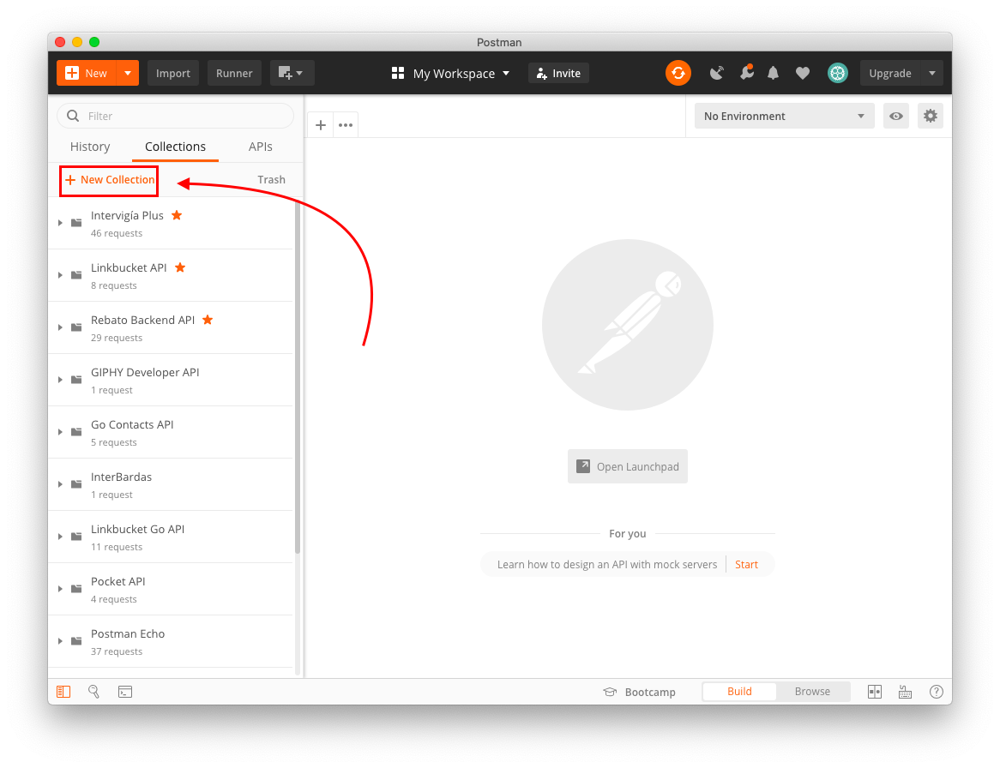
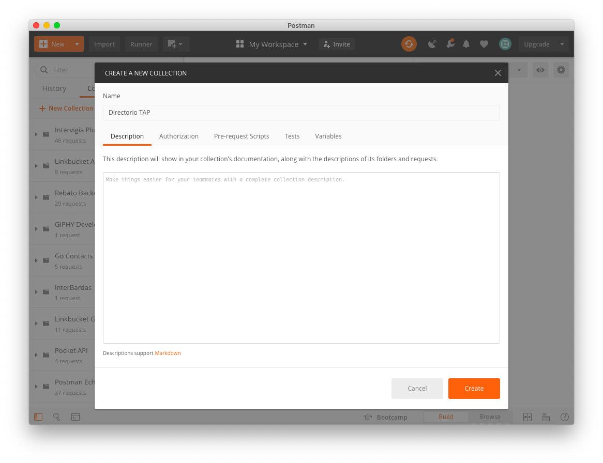

### `POST /contact` (Create Contact)
1. Añadir un request llamado `Create Contact` a la colección `Directorio TAP`.
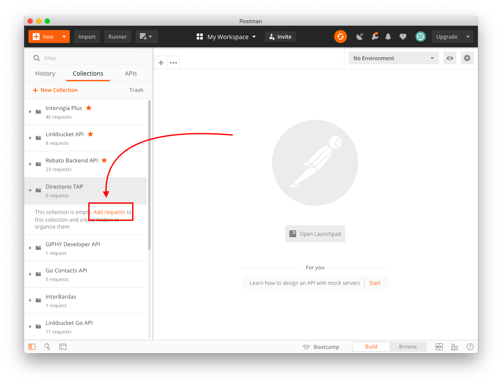
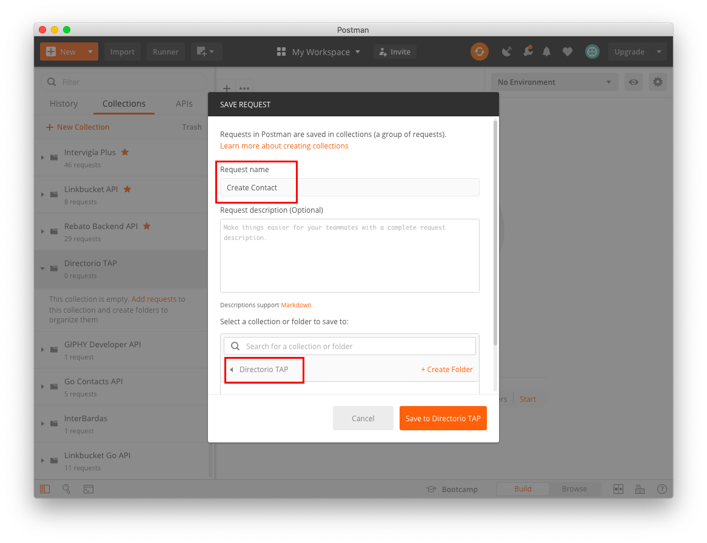
2. Configurar los parámetros del request.
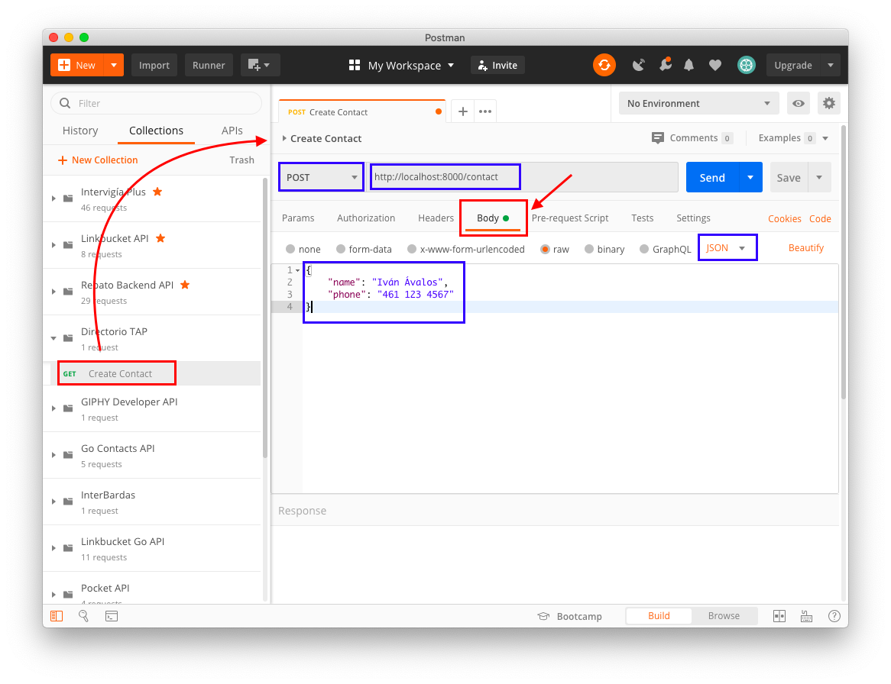
3. Enviar el request a nuestro API REST. Si nuestro response tiene código `200 OK` y el contenido es el objeto del contacto que creamos, ¡todo va bien hasta ahora! :3
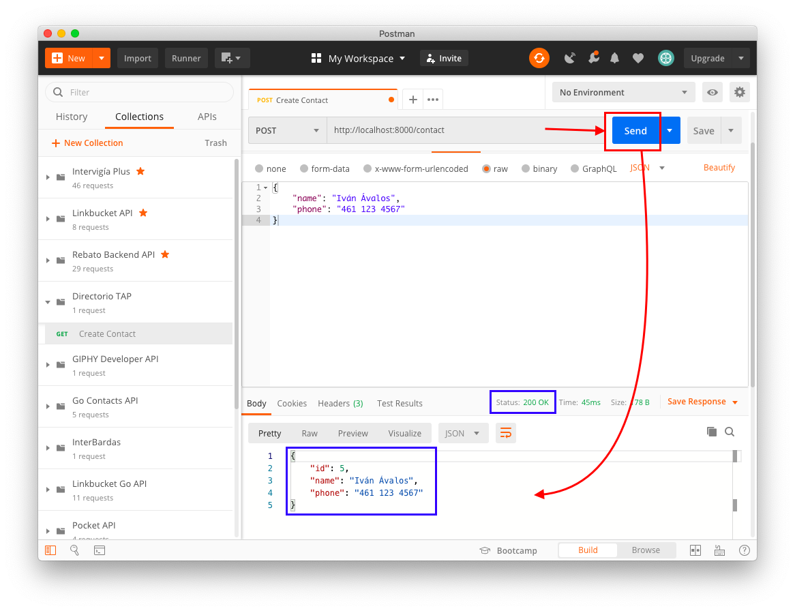
4. Si al body del request le quitamos el campo `name`, la response será `500 Internal Server Error`, indicando que nuestra validación está funcionando, ya que indicamos en nuestro `RequestContact` que los campos `name` y `phone` son `required`. Si no se satisfacen las condiciones de validación, el servidor responde con un error.
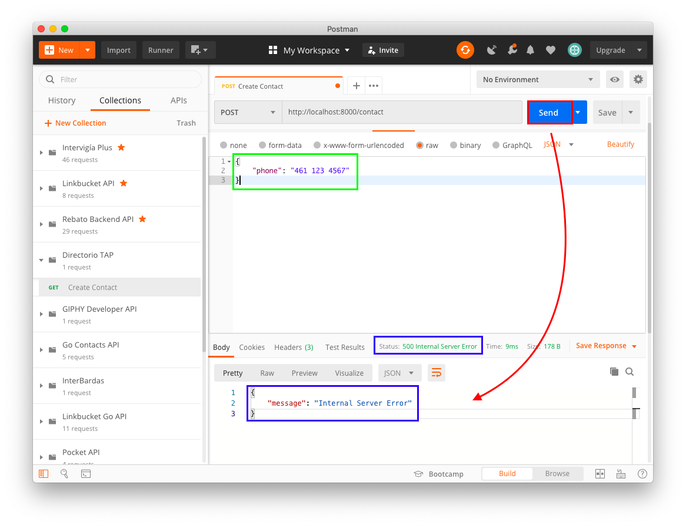

### `GET /contact` (Get Contacts)
1. Añadir un request llamado `Get Contacts` a la colección.
2. Configurar los parámetros del request y enviar.
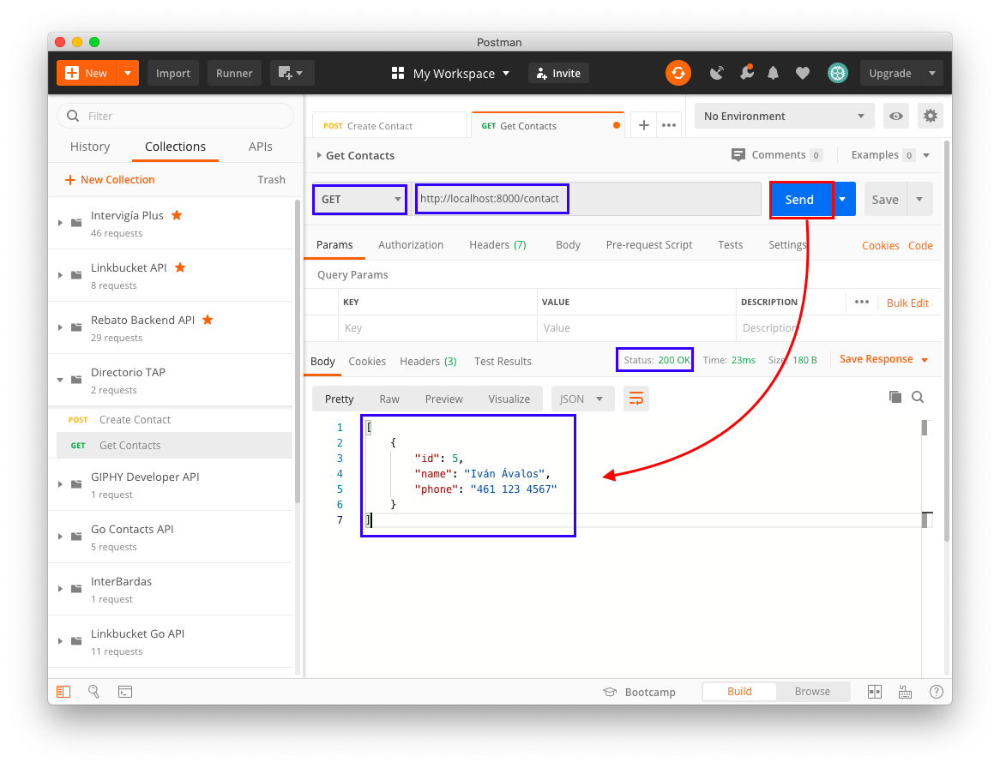
3. Si el response contiene un arreglo con el contacto que acabamos de crear, ¡todo va bien hasta ahora! :3

### `GET /contact/:id` (Get Contact)
1. Añadir un request llamado `Get Contact` a la colección.
2. Configurar los parámetros del request con el ID de algún contacto en la ruta y enviar.
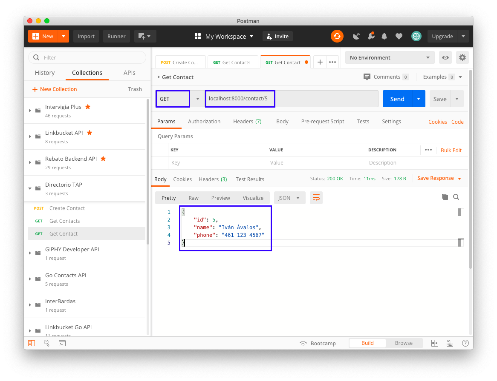
3. Cambiar el ID en la ruta por uno no existente y enviar. El servidor debería regresar `500 Internal Server Error` aunque no hayamos configurado validación, ya que el error lo regresa nuestro método `GetContact` y no la función `c.Validate`.
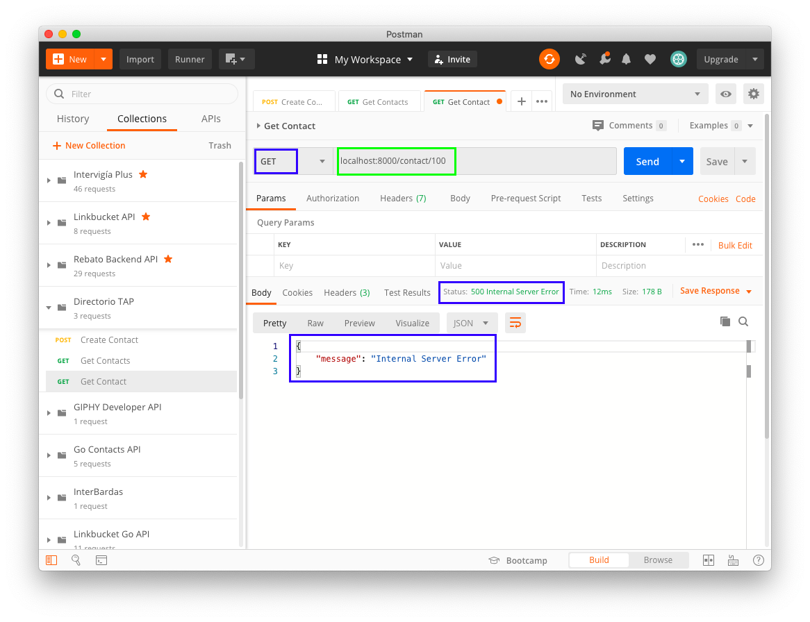

### `PUT /contact/:id` (Update Contact)
1. Añadir un request llamado `Update Contact` a la colección.
2. Configurar los parámetros del request con el ID de algún contacto en la ruta y enviar. Si el servidor regresa el objeto del contacto modificado, ¡todo va bien hasta ahora! :3
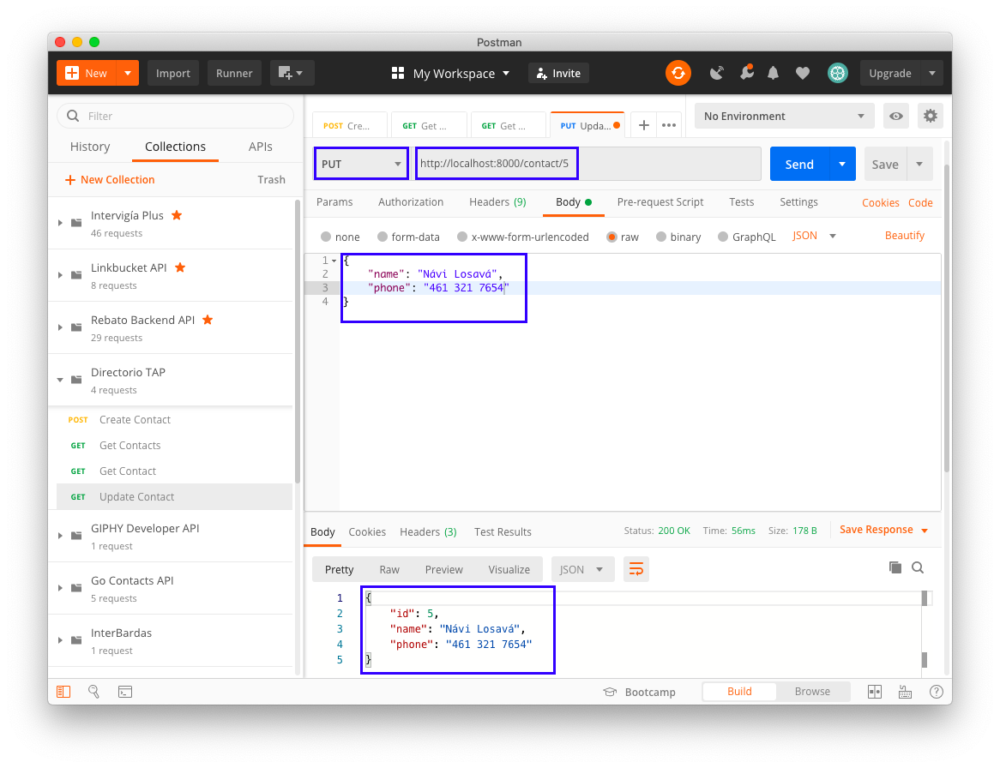
3. Como los campos `name` y `phone` ahora son opcionales, se puede omitir cualquiera de los dos o ambos, sin que el servidor regrese error. Solo se modificarán los campos presentes. Si el servidor regresa el objeto del contacto con solo el campo presente modificado, ¡todo va bien hasta ahora! :3
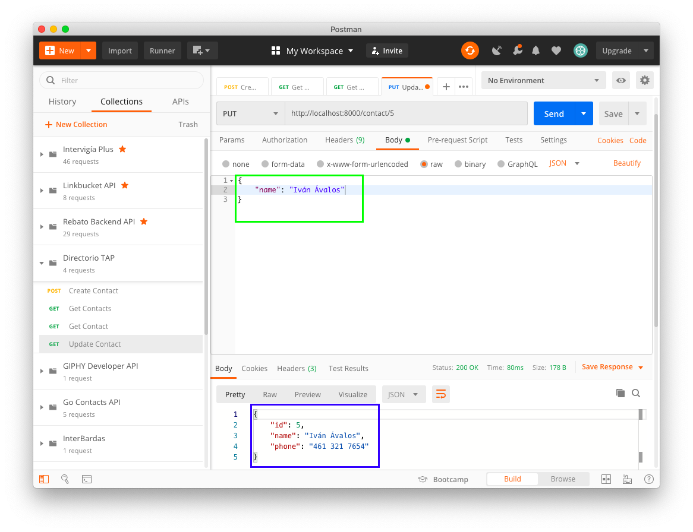

### `DELETE /contact/:id` (Delete Contact)
1. Añadir un request llamado `Delete Contact` a la colección.
2. Configurar los parámetros del request con el ID del algún contacto en la ruta y enviar. Si el servidor regresa el objeto del contacto eliminado, ¡todo va bien hasta ahora! :3
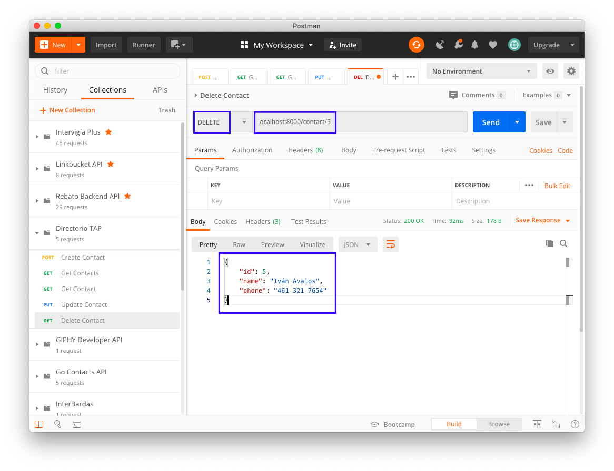

## Manejo de errores y estandarización de response
Pero ahora, nuestro servidor responde a cualquier error con un `500 Internal Server Error` y un objeto `{"message": "Internal Server Error"}`, lo cual no es para nada útil para el usuario o la aplicación que consume el API. Además, el objeto de respuesta siempre tiene que tener una misma estructura, para facilitar el manejo de errores y procesamiento de response del lado del cliente.

Un objeto de response exitoso, debería seguir siempre la siguiente estructura:

```json
{
    "code": 200,
    "data": ...
}
```

Un objeto de response fallido, debería contener los siguientes campos:

```json
{
    "code": ...,
    "type": ...,
    "message": ...,
    "data": ...
}
```

1. En la carpeta `utils`, crear un archivo llamado `http.go`, escribiremos al inicio `package utils`.
2. Añadimos lo siguiente al archivo:
```go
package utils

import (
    "net/http"

    "github.com/go-playground/validator"
    "github.com/go-sql-driver/mysql"
    "github.com/jinzhu/gorm"
    "github.com/labstack/echo"
)

type (
    // Response representa un response base
    Response struct {
        Code int         `json:"code"`
        Data interface{} `json:"data"`
    }
    // ErrorResponse representa un response de error
    ErrorResponse struct {
        Code    int         `json:"code"`
        Type    string      `json:"type"`
        Message string      `json:"message"`
        Data    interface{} `json:"data"`
    }
)

// BaseResponse regresa una response standard
func BaseResponse(code int, data interface{}) Response {
    return Response{
        Code: code,
        Data: data,
    }
}

func (er ErrorResponse) getErrorResponse() *echo.HTTPError {
    return echo.NewHTTPError(er.Code, er)
}

func processValidationError(errs validator.ValidationErrors) *echo.HTTPError {
    // Pueden copiar y pegar esto si quieren
    errsMap := make([]map[string]string, 0)
    for _, err := range errs {
        fieldErr := make(map[string]string)
        fieldErr["field"] = err.Field()
        fieldErr["tag"] = err.Tag()
        if err.Param() != "" {
            fieldErr["param"] = err.Param()
        }
        errsMap = append(errsMap, fieldErr)
    }
    return ErrorResponse{
        Code:    http.StatusBadRequest,
        Message: "Validation failed",
        Type:    "validation_failed",
        Data:    errsMap,
    }.getErrorResponse()
}

// ProcessError maneja adecuadamente un error para response
func ProcessError(err error) *echo.HTTPError {
    // También pueden copiar y pegar esto
    switch e := err.(type) {
    case validator.ValidationErrors:
        return processValidationError(e)
    case *mysql.MySQLError:
        return ErrorResponse{
            Code:    http.StatusInternalServerError,
            Type:    "database_error",
            Message: "database_error",
            Data:    e.Number,
        }.getErrorResponse()
    }
    switch err {
    case gorm.ErrRecordNotFound:
        return ErrorResponse{
            Code:    http.StatusNotFound,
            Type:    "not_found_error",
            Message: "Record not found",
            Data:    err.Error(),
        }.getErrorResponse()
    }
    return ErrorResponse{
        Code:    http.StatusInternalServerError,
        Type:    "unknown_error",
        Message: "Unknown error",
        Data:    nil,
    }.getErrorResponse()
}
```
3. Ahora será necesario reemplazarlos `return err` en nuestro `contact-controller.go` con `return utils.ProcessError(err)`, además de añadir `directorio-tap/` a la lista de `imports` de hasta arriba.
4. Ejecutamos nuevamente nuestra aplicación y procedemos a probar nuevamente nuestras rutas con Postman, esta vez intentando provocar errores para observar que el response sea el adecuado, y si es el caso, ¡todo va bien por ahora! :3
    + Un error de validación debería algo similar a esto:
    ```json
    {
        "code": 400,
        "type": "validation_failed",
        "message": "Validation failed",
        "data": [
            {
                "field": "Name",
                "tag": "required"
            }
        ]
    }
    ```
    + Si no se encuentra un registro en la base de datos, la respuesta debería ser:
    ```json
    {
        "code": 404,
        "type": "not_found_error",
        "message": "Record not found",
        "data": "record not found"
    }
    ```
    + Un error relacionado directamente con la conexión e interacción con la BD, debería regresar esto. (No es necesario que lo prueben por ahora.)
    ```json
    {
        "code": 500,
        "type": "database_error",
        "message": "Database error",
        "data": ...
    }
    ```
    + Un error diferente a los anteriores, regresará lo siguiente (tampoco es necesario que lo prueben esta vez):
    ```json
    {
        "code": 500,
        "type": "database_error",
        "message": "Database error",
        "data": ...
    }
    ```

## ¡Felicidades!

Si lograste completar exitosamente todos los pasos anteriores, ¡felicidades! ¡Tu API REST ahora funciona perfectamente! ¡Todo salió bien :3!
